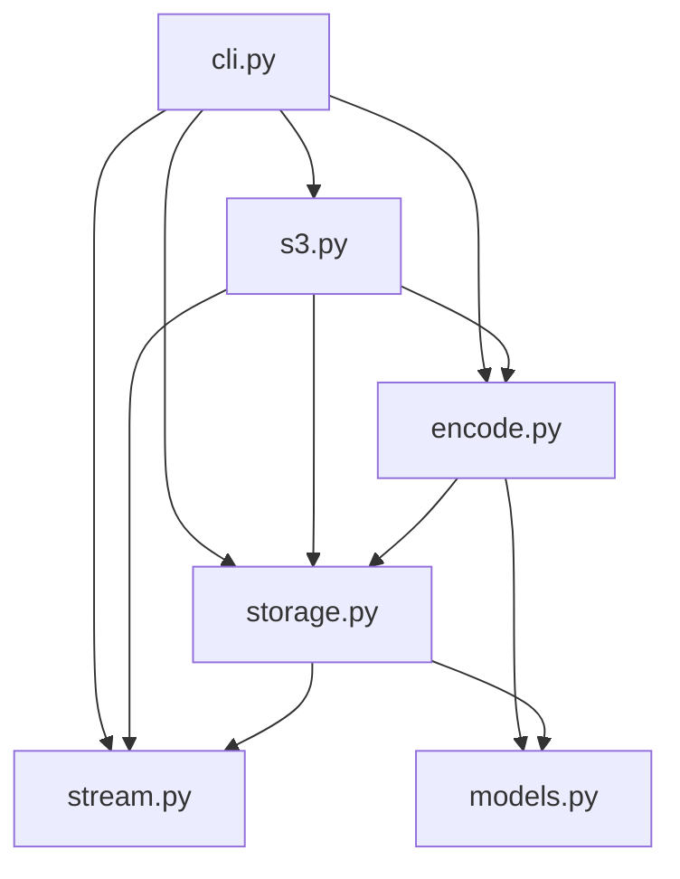

# Architecture

LiveZip is a small library with a sharp boundary: **describe**, **plan**,
**stream**. This page maps the modules onto that boundary and explains why the
three properties (memory-bound, streamable, predictable) fall out of it.

## Package layout

```
src/livezip/
├── __init__.py     # the public surface
├── models.py       # byte-exact PKZIP/ZIP64 records (no I/O)
├── storage.py      # CompactFile strategies (sizes known up front)
├── stream.py       # DataStream sources (deferred I/O)
├── encode.py       # ZipEncoder + segments (the streaming core)
├── s3.py           # optional S3 integration (boto3 behind a protocol)
└── cli.py          # the `livezip` console script
```

Each module has one job and depends only on the ones below it:



`models.py` is the leaf: it knows how to serialise records to bytes and nothing
else. `encode.py` never touches the filesystem, the network, or compression — it
orchestrates the other pieces.

## The three phases

Archives are built in three steps: **describe** the files (no I/O), **plan** by
turning them into segments and computing every offset (still no I/O), and
**stream** the bytes. The segment-level detail lives in
[the encoding pipeline](encoding-pipeline.md); this page covers the modules and
guarantees around it.

## Complexity

Let `k` be the number of files and `n` the combined size of the payloads.

| Resource | Complexity | Why |
| -------- | ---------- | --- |
| Memory | `O(k)` | The segment list plus one open payload stream. |
| Time | `O(n)` | Each payload byte is read and written exactly once. |

The per-file constant is dominated by the segment objects and the offset dict —
on the order of a kilobyte. An archive of 100 000 files therefore needs around
100 MB of bookkeeping and can stream terabytes of payload.

!!! note "Where the memory actually goes"
    The index is unavoidable: the ZIP central directory must be written *after*
    all payloads, so it has to be retained. That is the `O(k)` term. Everything
    else is constant.

## Serving over HTTP

Because `file_size` is exact, the encoder plugs directly into a streaming HTTP
response:

```python
encoder = build_archive(files, comment="nightly export")
response = StreamingHttpResponse(encoder.get_data(), content_type="application/zip")
response["Content-Length"] = str(encoder.file_size)
response["Content-Disposition"] = 'attachment; filename="export.zip"'
```

The recommendation for production, if you serve archives alongside normal
traffic, is to run a dedicated worker pool for zip streaming so that a burst of
large archives cannot starve regular requests.

## Trade-offs

- **No on-the-fly compression.** Required for predictability. Pre-compress and
  use [`PrecompressedDeflate`](storage.md#precompresseddeflate), or accept the
  small framing overhead of [`DeflateStore`](storage.md#deflatestore).
- **The whole file list is in memory.** `O(k)`, not `O(1)`. There is no way
  around it: the central directory needs every entry.
- **UTF-8 entry names.** The general-purpose UTF-8 bit is always set, which all
  modern readers understand.
