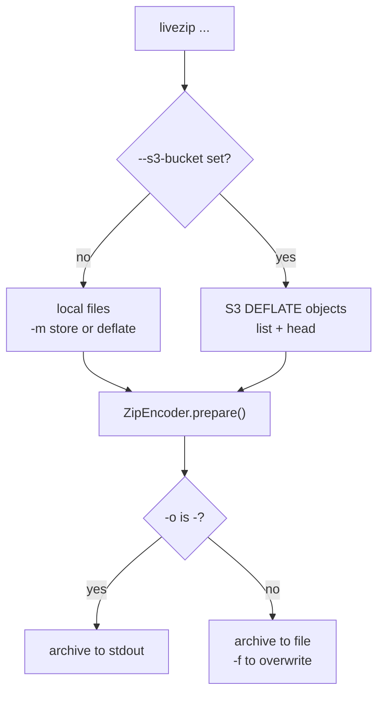

# Command line

The `livezip` console script packs local files, or streams a bucket of DEFLATE
objects, into a ZIP64 archive. It is a thin wrapper over the library, useful for
smoke-testing and for one-off jobs.

```bash
livezip --help
```



## Synopsis

```
livezip [-h] [--version] [-o OUTPUT] [-f] [-c COMMENT] [-m {store,deflate}]
        [--s3-bucket BUCKET] [--s3-prefix PREFIX]
        [--s3-endpoint-url URL] [--s3-region REGION]
        [FILES ...]
```

## Options

| Option | Default | Meaning |
| ------ | ------- | ------- |
| `-o`, `--output` | `-` (stdout) | Destination file, or `-` for stdout. |
| `-f`, `--force` | off | Overwrite an existing output file. |
| `-c`, `--comment` | `""` | Archive-level comment. |
| `-m`, `--method` | `deflate` | Storage method for local files: `store` or `deflate`. |
| `--s3-bucket` | — | Enables S3 mode; read objects from this bucket. |
| `--s3-prefix` | `""` | Restrict S3 mode to keys starting with this prefix. |
| `--s3-endpoint-url` | — | Custom S3 endpoint (SeaweedFS, MinIO, ...). |
| `--s3-region` | — | AWS region name. |
| `FILES ...` | — | Local files to pack. Ignored in S3 mode. |

## Local mode

```bash
livezip -o archive.zip photo.jpg video.mp4 notes.txt
livezip -m store -o raw.zip blob.bin
livezip -c "nightly export" -o export.zip data/*.csv
```

Entry names keep their path relative to the current working directory; files
outside it fall back to their base name, so archives never contain absolute
paths.

## S3 mode

```bash
livezip --s3-bucket my-logs --s3-prefix 2026/ -o logs.zip
```

In S3 mode the positional `FILES` are ignored (a warning is printed if any are
given). Each object must carry the metadata described in
[Streaming from S3](s3-integration.md#the-metadata-contract).

## Streaming to stdout

When `-o` is `-` (the default), progress goes to **stderr** and the archive goes
to **stdout**, so it composes cleanly:

```bash
livezip --s3-bucket my-logs --s3-prefix 2026/ > logs.zip
livezip --s3-bucket my-logs | ssh backup@host 'cat > logs.zip'
livezip -o - file.bin | curl -T - https://example.com/upload
```

## Exit codes

| Code | Meaning |
| ---- | ------- |
| `0` | Success. |
| `1` | A handled error (missing input, would overwrite, S3 metadata missing, ...). |
| `2` | Argument parsing error (from `argparse`). |

## Progress output

Everything the tool reports is written to stderr, and looks like:

```
livezip: prepared 3 file(s), archive size is 14241 bytes
```

The size is computed before any file is read — the same guarantee the library
makes.
