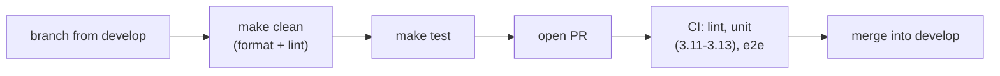

# Contributing

LiveZip is `uv`-managed and keeps a deliberately small dependency surface: the
core has **zero** runtime dependencies, and the S3 integration is an optional
extra. Please keep it that way where you reasonably can.

## Prerequisites

- [uv](https://docs.astral.sh/uv/) (the only required tool).
- Python 3.11+ — `uv` will fetch a suitable interpreter if needed.
- Docker, only to run the end-to-end suite.

## Getting started

```bash
git clone https://github.com/OffworldNexus/livezip.git
cd livezip
uv sync --all-extras     # or: make sync
make test-unit
```

## The Makefile

| Target | What it does |
| ------ | ------------ |
| `make sync` | Install every dependency, including the `s3` extra. |
| `make format` | Auto-fix imports and formatting (ruff). |
| `make lint` | `ruff check` + `ruff format --check` + `mypy`. |
| `make typecheck` | `mypy` only. |
| `make test-unit` | Fast tests, no Docker. |
| `make test-e2e` | SeaweedFS-backed tests. |
| `make test` | Both. |
| `make coverage` | Both, with a coverage report. |
| `make docs` / `make docs-serve` | Build / preview the documentation. |
| `make build` | Build the sdist and wheel into `dist/`. |
| `make clean` | `format` then `lint`. |

Before opening a pull request, `make clean && make test` should be green.

## Linting and typing

Ruff is configured in `[tool.ruff]` in `pyproject.toml`. The rule selection is
inherited from the author's other projects — the intent is:

| Group | Rules | Why |
| ----- | ----- | --- |
| Core | `E`, `W`, `F`, `I`, `C90`, `D1`, `S` | Correctness, imports, complexity, docstrings, security. |
| Hygiene | `UP`, `PTH`, `TCH`, `ERA`, `FIX`, `TID251` | Modern syntax, `pathlib`, type-only imports, no dead code. |
| Testing | `PT` | Pytest idioms. |
| Misc | `A`, `B`, `DTZ`, `EM`, `EXE`, `G`, `T10`, `T20`, `SLOT`, `INP`, `ASYNC`, `RUF` | Bugs, timezone-awareness, error-message hygiene, ... |

Docstrings follow the **numpy** convention (`[tool.ruff.lint.pydocstyle]`).
`requests` is banned in favour of `httpx` (timeouts by default); the core does
not import either.

`mypy` runs over `src/` only, with `disallow_untyped_defs` — every public
function is annotated.

## Documentation

Project documentation lives in `doc/` and is built with
[Zensical](https://zensical.org/) (a Material-for-MkDocs descendant). It is
organised by perspective; today the only perspective is **Developer**.

```bash
make docs-serve   # http://localhost:8000
make docs         # build into doc/site
```

It is deployed to GitHub Pages by `.github/workflows/deploy-docs.yml` on every
push to `develop`, at <https://offworldnexus.github.io/livezip/>.

When you change behaviour, update the relevant page **and** the inline
docstrings. Use Mermaid fenced blocks for diagrams; they are rendered by the
site.

## Commit and pull-request flow



1. Branch from `develop`.
2. Keep the change focused; format and lint before committing.
3. Write a clear commit message: a short imperative subject, then a body that
   explains **why**.
4. Open a pull request against `develop`. CI runs lint, unit tests across
   Python versions, and the SeaweedFS end-to-end job.

## Packaging and releases

The build backend is [hatchling](https://hatch.pypa.io/); the package uses a
`src/` layout declared in `[tool.hatch.build.targets.wheel]`.

```bash
make build        # dist/livezip-<version>-py3-none-any.whl + sdist
```

Versions live in `pyproject.toml` and are mirrored by `livezip.__version__`; a
unit test keeps the two in sync.

### Releasing

Releases publish to PyPI from a Git tag using **Trusted Publishing** (OIDC), so
no API token is stored anywhere. The tag must be `v<version>` and match
`project.version`; the build job fails otherwise.

```bash
# 1. Set version in pyproject.toml (and livezip.__version__), then merge.
# 2. Tag and push — this triggers .github/workflows/release.yml:
git tag v1.0.0
git push origin v1.0.0
```

The workflow builds the sdist and wheel, publishes them to PyPI through the
`pypi` environment, and creates the GitHub Release.

A maintainer configures this **once** on PyPI by adding a *pending publisher*
with these exact fields:

| Field | Value |
| ----- | ----- |
| PyPI project name | `livezip` |
| Owner | `OffworldNexus` |
| Repository name | `livezip` |
| Workflow name | `release.yml` |
| Environment name | `pypi` |
