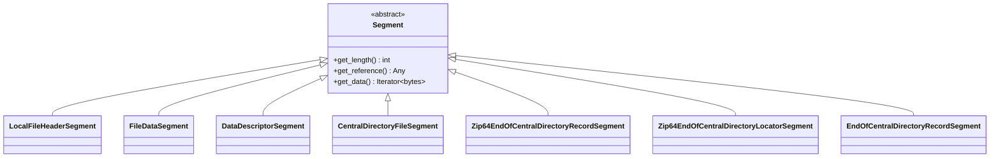
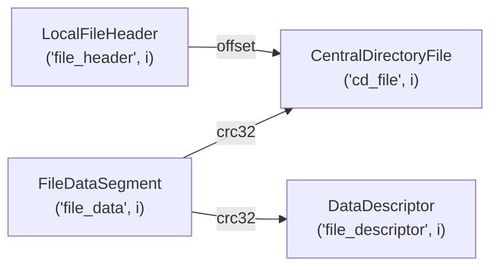
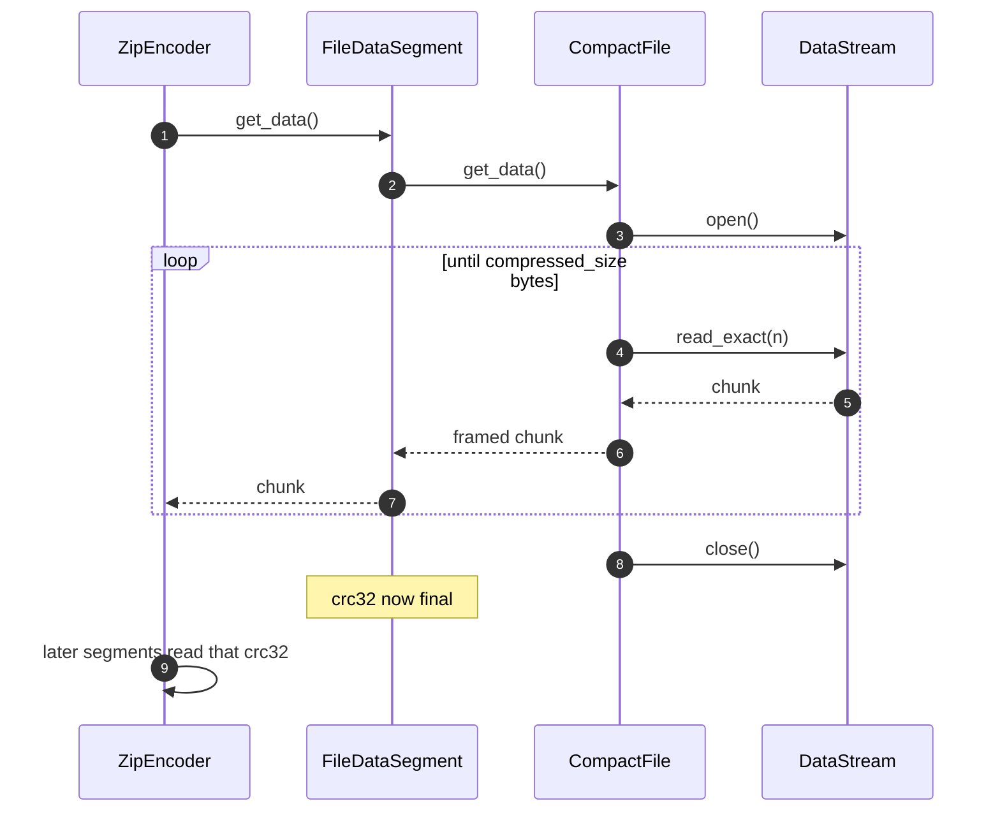

# The encoding pipeline

This page is about `src/livezip/encode.py`: how a list of files becomes a list of
segments, how segments find each other, and how the three stages fit together.

## Segments

A `Segment` is one binary record of the archive. Every segment implements three
methods:

| Method | Contract |
| ------ | -------- |
| `get_length()` | Return the exact byte length, **without** producing the bytes. |
| `get_reference()` | Return a hashable key other segments can use to find this one. |
| `get_data()` | Yield the bytes (an iterator, possibly empty). |

The concrete segments, in archive order:



| Segment | Reference | Notes |
| ------- | --------- | ----- |
| `LocalFileHeaderSegment` | `("file_header", i)` | Zeroed sizes; streaming flag set. |
| `FileDataSegment` | `("file_data", i)` | Delegates to the `CompactFile`; computes CRC. |
| `DataDescriptorSegment` | `("file_descriptor", i)` | Reads the CRC off the data segment. |
| `CentralDirectoryFileSegment` | `("cd_file", i)` | Reads the CRC and the header offset. |
| `Zip64EndOfCentralDirectoryRecordSegment` | `"eocd64_record"` | Zero bytes unless required. |
| `Zip64EndOfCentralDirectoryLocatorSegment` | `"eocd64_locator"` | Mirrors the record's presence. |
| `EndOfCentralDirectoryRecordSegment` | `"eocd"` | Always present, always last. |

## Inter-segment references

Segments are not independent: a data descriptor needs the CRC that the data
segment computed, and a central directory entry needs the offset at which the
local header was written. LiveZip resolves both through the encoder, which owns
an offset table and an index of segments built during `compute_offsets()`.



The references are plain hashable tuples. `get_segment(ref)` returns the object;
`get_offset(ref)` returns its byte offset. Because every reference is resolved
*after* offsets are known, `get_data()` is a simple forward walk with no
back-patching.

## The three stages

### 1. `make_segments()`

Builds the ordered list:

1. For each file: local header, data, data descriptor.
2. For each file: one central directory entry.
3. The ZIP64 EOCD record and locator (possibly zero-length), then the EOCD.

### 2. `compute_offsets()`

Walks the list once, recording each segment's offset and indexing it by
reference. Crucially, it only calls `get_length()` — no payload is read. This is
the step that makes the output **predictable**.

```python
offset = 0
for segment in self.segments:
    reference = segment.get_reference()
    self.offsets[reference] = offset
    self.indexed_segments[reference] = segment
    offset += segment.get_length()
self.file_size = offset
```

### 3. `get_data()`

Streams each segment in order. When a `FileDataSegment` is reached, it opens its
`DataStream`, yields chunks while updating the CRC32, then closes the stream.



## Size guarantees are checked, not assumed

Because a single wrong byte corrupts every subsequent offset, the data segment
verifies the stream against the announced size:

- if the storage yields **more** than `compressed_size`, it raises immediately;
- if it yields **fewer**, it raises once the stream is exhausted.

`PrecompressedDeflate` enforces the same rule for its input. See
[Storage strategies](storage.md) for the contract a custom strategy must honour.

## Public entry points

| Symbol | Use |
| ------ | --- |
| `ZipFile` | Named tuple describing one entry. |
| `ZipEncoder` | The staged encoder (`prepare()` + `get_data()`). |
| `build_archive(files, comment="")` | Convenience: construct + `prepare()`. |
| `ZippedStream` | A prepared encoder paired with its size. |

## Next

- How payloads are laid out: [Storage strategies](storage.md).
- Where bytes come from: [Byte streams](streams.md).
