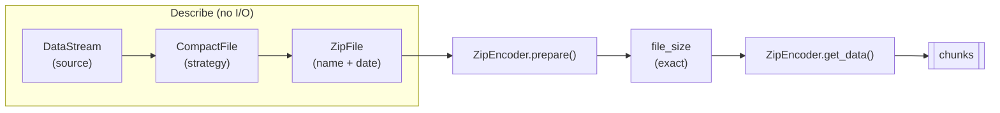

# Getting started

LiveZip turns a list of files into a streamed ZIP64 archive. Where those files
come from — disk, HTTP, memory, an object store — is a detail: the encoder only
ever sees two small abstractions, so **sources are interchangeable and can be
mixed freely in a single archive**.

## Install

LiveZip requires Python 3.11+ and is managed with
[uv](https://docs.astral.sh/uv/):

```bash
uv add livezip          # core: zero runtime dependencies
uv add "livezip[s3]"    # optional boto3-backed S3 integration
```

The package is `src`-layout, fully typed (`py.typed`), and ships a console
script named `livezip`.

## How to use it

Every archive is built the same way, **regardless of where the bytes live**:

1. Pick a **source** — a `DataStream` (`FileStream`, `BytesStream`, `UrlStream`,
   `S3Stream`, or your own).
2. Pick a **storage strategy** — how the bytes are laid out (`Store`,
   `DeflateStore`, `PrecompressedDeflate`).
3. Wrap each file in a **`ZipFile`** (entry name, timestamp, strategy).
4. **Encode** — `prepare()` to learn the exact size, `get_data()` to stream.

```python
from datetime import UTC, datetime
from pathlib import Path

from livezip import BytesStream, FileStream, Store, UrlStream, ZipEncoder, ZipFile

when = datetime.now(UTC)
clip = Path("clip.mp4")
manifest = b'{"generated": true}'

files = [
    # from disk
    ZipFile(
        "clip.mp4", Store(FileStream(clip), clip.stat().st_size), when, is_binary=True
    ),
    # from memory
    ZipFile(
        "manifest.json",
        Store(BytesStream(manifest), len(manifest)),
        when,
        is_binary=True,
    ),
    # from anywhere HTTP (URL resolved lazily, so signatures cannot expire)
    ZipFile(
        "remote.bin",
        Store(UrlStream(lambda: signed_url), remote_size),
        when,
        is_binary=True,
    ),
]

encoder = ZipEncoder(files)
encoder.prepare()
print(encoder.file_size)  # exact, before a single byte is read

with open("archive.zip", "wb") as out:
    for chunk in encoder.get_data():  # sources opened one at a time
        out.write(chunk)
```

Swapping a local file for an S3 object or an HTTP URL changes **only the
`DataStream`**. Everything downstream — strategies, `ZipFile`, offsets, the
predicted size — is identical.

### Sources

The source is responsible for one thing: yielding bytes when asked. Because it
is opened lazily, describing and preparing an archive never touches the data.

| Source | `DataStream` | Where the size comes from |
| ------ | ------------ | ------------------------- |
| Local file | `FileStream(path)` | `path.stat().st_size` |
| In-memory bytes | `BytesStream(data)` | `len(data)` |
| HTTP(S) URL | `UrlStream(lambda: url)` | a `HEAD` / your own metadata |
| S3 object | `S3Stream(client, bucket, key)` | the object listing |
| Bucket of DEFLATE logs | `zip_from_s3(...)` helper | listing + object metadata |

See [Byte streams](streams.md) for the interface and how to write your own, and
[Streaming from S3](s3-integration.md) for the bucket helper.

### Storage strategies

The strategy declares the sizes *before* the payload is read — that is what
makes the archive size predictable.

| Strategy | Method | Stored size | Use when |
| -------- | ------ | ----------- | -------- |
| `Store` | 0 | `n` | Payload is incompressible (video, JPEG, ...). |
| `DeflateStore` | 8 | `n + 5·max(1, ⌈n/65535⌉)` | A client insists on DEFLATE, no real compression. |
| `PrecompressedDeflate` | 8 | the existing bytes | Payload is already raw DEFLATE (cached, or S3 logs). |

Full details and a custom-strategy example are in
[Storage strategies](storage.md).

## The mental model



- A **`DataStream`** knows how to open a source, but does not open it until the
  encoder reads it.
- A **`CompactFile`** wraps a source and declares, without reading it, the
  compressed size, uncompressed size, compression method and (sometimes) CRC32.
- A **`ZipFile`** pairs a strategy with an entry name and a timestamp.
- The **`ZipEncoder`** turns the list into binary records, computes their
  offsets, then streams them.

## Guarantees

| Guarantee | Depends on |
| --------- | ---------- |
| Predictable size | Every strategy reporting its sizes before being read. |
| Bounded memory | One payload stream open at a time, plus the index (`O(k)`). |
| Exact offsets | Offsets computed once, up front, in `prepare()`. |

## Where to go next

- [Byte streams](streams.md) — sources and the lazy-open contract.
- [Storage strategies](storage.md) — how payloads are laid out.
- [Streaming from S3](s3-integration.md) — the logs-to-ZIP recipe.
- [Architecture](architecture.md) — modules, complexity, HTTP serving.
- [The ZIP format](zip-format.md) — the bytes on the wire.
