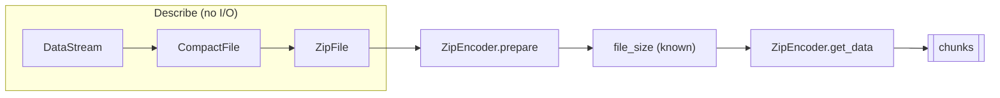

# Developer overview

This page is the entry point for engineers who use or maintain LiveZip. It
covers installation, a first archive, and the mental model you need before the
deeper pages make sense.

## What LiveZip is

LiveZip is a ZIP64 *writer*. It takes a list of files — each described by a
storage strategy and a byte source — and produces the archive as a stream of
chunks. It deliberately does not read the files to build an index, and it does
not compress on the fly.

That last point is the design constraint everything else follows from. Classic
zip writers compress as they go, so they only learn the final size once they are
done. LiveZip requires the *compressed* size of every entry to be known before
it starts, which lets it:

1. compute every offset in the archive up front,
2. know the total size, and
3. stream the bytes without ever revisiting a decision.

The price is that compression is the caller's responsibility — which is exactly
what you want for videos, photos, and logs that were compressed when they were
stored.

## Install

LiveZip is managed with [uv](https://docs.astral.sh/uv/) and requires Python
3.11 or newer.

```bash
uv add livezip          # core: zero runtime dependencies
uv add "livezip[s3]"    # with the boto3-backed S3 integration
```

The package is `src`-layout, fully typed (`py.typed`), and ships with a console
script named `livezip`.

## A first archive

```python
from datetime import UTC, datetime
from pathlib import Path

from livezip import FileStream, Store, ZipEncoder, ZipFile

path = Path("clip.mp4")

encoder = ZipEncoder(
    [
        ZipFile(
            path="clip.mp4",
            data=Store(FileStream(path), path.stat().st_size),
            modification_date=datetime.fromtimestamp(path.stat().st_mtime, tz=UTC),
            is_binary=True,
        )
    ]
)
encoder.prepare()
print(encoder.file_size)  # the exact output size, before any read

with open("clip.zip", "wb") as out:
    for chunk in encoder.get_data():
        out.write(chunk)
```

Three things to notice:

- `Store` is handed the size; it does not measure the file.
- `prepare()` is the point at which the size becomes known. Nothing is read.
- `get_data()` is a generator. Memory stays flat no matter how big `clip.mp4`
  is.

## The mental model



- A **DataStream** knows *how to open* a byte source (a file, an HTTP URL, an S3
  object) but does not open it until the encoder asks for bytes.
- A **CompactFile** wraps a DataStream and declares, without reading it, the
  compressed size, the uncompressed size, the compression method and (for some
  strategies) the CRC32.
- A **ZipFile** pairs a CompactFile with an entry name and a timestamp.
- The **ZipEncoder** turns the list of ZipFiles into an ordered list of binary
  records ("segments"), computes each one's offset, and then streams them.

## The guarantees, and what they depend on

| Guarantee | Depends on |
| --------- | ---------- |
| Predictable size | Every `CompactFile` reporting its sizes before being read. |
| Bounded memory | One entry's payload being alive at a time, plus the index. |
| Exact offsets | Offsets being computed once, up front, in `prepare()`. |

If you write a custom storage strategy, the contract you must uphold is exactly
those first two bullets: announce `compressed_size` correctly, and yield exactly
that many bytes from `get_data()`.

## Next

- [Architecture](architecture.md) maps the modules onto these concepts.
- [The ZIP format](zip-format.md) explains the bytes.
- [Streaming from S3](s3-integration.md) is the flagship use case.
