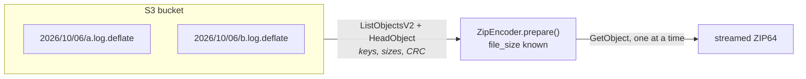
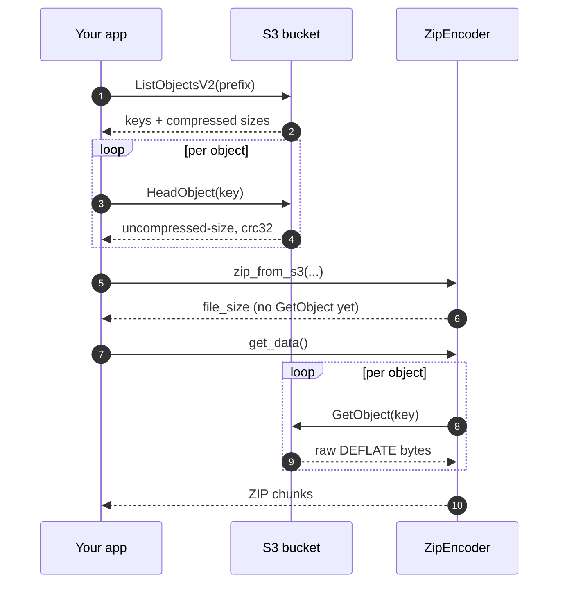

# Streaming from S3

LiveZip's original use case: **a bucket of DEFLATE-compressed logs, streamed
straight into one ZIP**, with the exact output size known before a single
payload byte is downloaded.



A raw DEFLATE stream (RFC 1951) does not carry the original size or a CRC32, and
ZIP needs both. LiveZip reads them from **object metadata** rather than the body,
so planning stays a cheap `HEAD` request instead of a download.

!!! note "Why metadata and not the object body?"
    Decompressing the object, or reading its trailer, would reveal the size and
    checksum — but only *after* transferring it, which is exactly what this flow
    avoids.

## The metadata contract

| Metadata key | Value | Example |
| ------------ | ----- | ------- |
| `uncompressed-size` | Original size in bytes, decimal | `2004560` |
| `crc32` | CRC32 of the original bytes, 8 hex digits | `1a2b3c4d` |

`put_deflate_object()` compresses raw DEFLATE and writes both keys:

```python
from livezip.s3 import create_client, put_deflate_object

client = create_client(endpoint_url="http://localhost:8333")
put_deflate_object(client, "my-logs", "2026/10/06/app.log.deflate", log_bytes)
```

If an object is missing the metadata, `list_deflate_objects()` raises a
`ValueError` naming it.

## The flow

```python
from livezip.s3 import create_client, list_deflate_objects, zip_from_s3

client = create_client(region_name="eu-west-3")

# 1. Discover — one listing plus one HEAD per object, no payloads
objects = list_deflate_objects(client, "my-logs", prefix="2026/")
for obj in objects:
    print(obj.key, obj.compressed_size, obj.uncompressed_size, obj.compression_ratio)

# 2. Prepare — the archive layout and size are now exact, still no payloads
encoder = zip_from_s3(client, "my-logs", prefix="2026/", comment="October logs")
print(encoder.file_size)

# 3. Stream — objects are fetched one at a time, read once, released
with open("logs.zip", "wb") as out:
    for chunk in encoder.get_data():
        out.write(chunk)
```

- `list_deflate_objects()` paginates `ListObjectsV2`, then issues one
  `HeadObject` per key for `uncompressed-size` and `crc32` (and the authoritative
  `ContentLength`). Results are sorted by key, so the same prefix always yields
  the **same archive**.
- `zip_from_s3()` builds one `ZipFile` per object, each a
  `PrecompressedDeflate` over an `S3Stream`. Entry names drop the `.deflate`
  suffix; pass `path_for=lambda obj: ...` to customise them.
- The objects are ordinary [`DataStream`](streams.md)s, so this is just the
  source-agnostic recipe from [Getting started](index.md) with an S3 source.

The same flow as a script is in
[`examples/s3_to_zip.py`](https://github.com/OffworldNexus/livezip/blob/develop/examples/s3_to_zip.py),
and
[`tests/e2e/test_s3_roundtrip.py`](https://github.com/OffworldNexus/livezip/blob/develop/tests/e2e/test_s3_roundtrip.py)
runs it against a real SeaweedFS container.

### End-to-end sequence



## From the command line

```bash
livezip --s3-bucket my-logs --s3-prefix 2026/ -o logs.zip
```

See [Command line](cli.md) for options, stdout streaming and exit codes.

## Operational notes

- **Cost.** One `ListObjectsV2` per 1 000 objects, one `HeadObject` per object,
  then one `GetObject` per object. No body is transferred twice.
- **Latency.** The `HEAD`s dominate `prepare()`. For repeat use, list once and
  cache the `DeflateObject`s instead of re-heading.
- **Plain HTTP instead.** To fetch through a CDN or with a signed URL, wrap the
  same plan's sizes in a `PrecompressedDeflate` over a `UrlStream`.
- **boto3 is optional.** `import livezip.s3` works without it; only
  `create_client()` imports `boto3` and raises a clear `ImportError` otherwise.

## Troubleshooting

| Symptom | Cause | Fix |
| ------- | ----- | --- |
| `missing valid livezip metadata` | Object was not uploaded with the metadata | Re-upload with `put_deflate_object`. |
| `Expected N compressed bytes but the stream yielded M` | The object changed after listing | Re-run; the plan froze the old size. |
| An entry is corrupt after extraction | The size/CRC metadata is wrong | Re-upload with `put_deflate_object`. |
