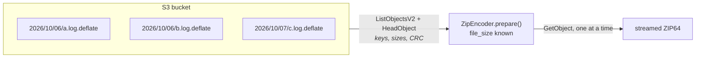
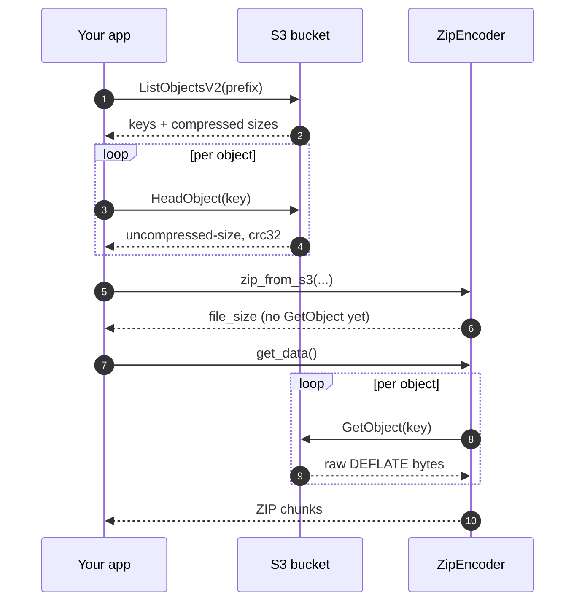

# Streaming from S3

This is the use case LiveZip was rebuilt around: **a bucket of
DEFLATE-compressed logs, streamed straight into one ZIP.**



The constraints are the usual ones: you must not download the whole prefix to
plan the archive, you must not hold it in memory, and you must be able to
announce the exact `Content-Length` before the first byte leaves your server.

## The metadata contract

A raw DEFLATE stream (RFC 1951) does not carry the original size or a CRC32, and
ZIP needs both. LiveZip therefore requires them to be stored as **S3 object
metadata** next to the payload:

| Metadata key | Value | Example |
| ------------ | ----- | ------- |
| `uncompressed-size` | Original size in bytes, decimal | `2004560` |
| `crc32` | CRC32 of the original bytes, 8 hex digits | `1a2b3c4d` |

Both are written automatically by `put_deflate_object()`:

```python
from livezip.s3 import create_client, put_deflate_object

client = create_client(endpoint_url="http://localhost:8333")
put_deflate_object(client, "my-logs", "2026/10/06/app.log.deflate", log_bytes)
```

!!! note "Why metadata and not the object body?"
    Reading the trailer of a DEFLATE stream (or decompressing it) would tell us
    the size and checksum, but only *after* downloading the object — which is
    exactly what we are trying to avoid. Metadata keeps the planning step to a
    `HEAD` request.

## The three calls

### 1. List — discover and plan

```python
from livezip.s3 import list_deflate_objects

objects = list_deflate_objects(client, "my-logs", prefix="2026/")
```

`list_deflate_objects()` paginates `ListObjectsV2` to collect keys and object
sizes, then issues one `HeadObject` per key to read `uncompressed-size` and
`crc32` (and the authoritative `ContentLength`). The result is sorted by key, so
two listings of the same prefix produce **byte-identical** archives.

Each entry is a `DeflateObject`:

```python
@dataclass(frozen=True, slots=True)
class DeflateObject:
    bucket: str
    key: str
    compressed_size: int  # ContentLength (listing Size fallback)
    uncompressed_size: int  # from metadata
    crc32: int  # from metadata
    last_modified: datetime
```

If an object is missing either metadata key, a `ValueError` names the object and
tells you to re-upload it with `put_deflate_object()`.

### 2. Prepare — no payloads yet

```python
from livezip.s3 import zip_from_s3

encoder = zip_from_s3(client, "my-logs", prefix="2026/", comment="October logs")
print(encoder.file_size)  # exact, already known
```

Internally this builds one `ZipFile` per object, each wrapping a
`PrecompressedDeflate` over an `S3Stream`. Preparing reads no payload: the
`GetObject` calls happen only when `get_data()` reaches each entry.

The ZIP entry name is the object key with the `.deflate` suffix stripped (and
any leading slash removed). Pass `path_for=lambda obj: ...` to customise it.

### 3. Stream

```python
for chunk in encoder.get_data():
    response.write(chunk)
```

Objects are fetched one at a time, streamed through, and released. The CRC and
sizes are already encoded, so each object is read exactly once.

## End-to-end sequence



## Complete example

```python
# /// script
# requires-python = ">=3.11"
# dependencies = ["livezip[s3]"]
# ///
from livezip.s3 import create_client, zip_from_s3

client = create_client(
    endpoint_url="http://localhost:8333",  # omit for AWS
    region_name="eu-west-3",
)

encoder = zip_from_s3(client, "my-logs", prefix="2026/", comment="October logs")
print(f"archive is {encoder.file_size} bytes")

with open("logs.zip", "wb") as out:
    for chunk in encoder.get_data():
        out.write(chunk)
```

The same flow as a script lives in
[`examples/s3_to_zip.py`](https://github.com/OffworldNexus/livezip/blob/develop/examples/s3_to_zip.py),
and the end-to-end test
[`tests/e2e/test_s3_roundtrip.py`](https://github.com/OffworldNexus/livezip/blob/develop/tests/e2e/test_s3_roundtrip.py)
runs it against a real SeaweedFS container.

## From the command line

The console script exposes the same flow:

```bash
livezip --s3-bucket my-logs --s3-prefix 2026/ -o logs.zip
```

See [Command line](cli.md) for the full option list, stdout streaming, and exit
codes.

## Operational notes

- **Cost.** Planning is one `ListObjectsV2` call per 1 000 objects plus one
  `HeadObject` per object; streaming is `k` `GetObject` calls. No object body is
  transferred twice.
- **Latency.** `HeadObject` round-trips dominate `prepare()`. For very large
  prefixes you can list once and cache `DeflateObject`s, then reuse them to build
  archives without re-heading.
- **Consistency.** The listing is sorted by key for determinism. If objects are
  added while you stream, they are simply absent — the plan is frozen at
  `prepare()`.
- **Signed URLs.** If you would rather fetch over plain HTTP (e.g. through a
  CDN), use a `PrecompressedDeflate` over a `UrlStream` instead of an
  `S3Stream`; the size/CRC still come from the plan.
- **boto3 is optional.** `import livezip.s3` works without it. Only
  `create_client()` imports boto3, and raises a clear `ImportError` pointing at
  the `s3` extra if it is missing.

## Troubleshooting

| Symptom | Cause | Fix |
| ------- | ----- | --- |
| `missing valid livezip metadata` | Object was not uploaded by `put_deflate_object` | Re-upload, or add the two metadata keys. |
| `Expected N compressed bytes but the stream yielded M` | The `compressed_size` in the plan does not match the object's `ContentLength` | The object changed after listing; re-run. |
| Archive opens but an entry is corrupt | The `crc32`/size metadata is wrong | Re-upload with `put_deflate_object`. |
