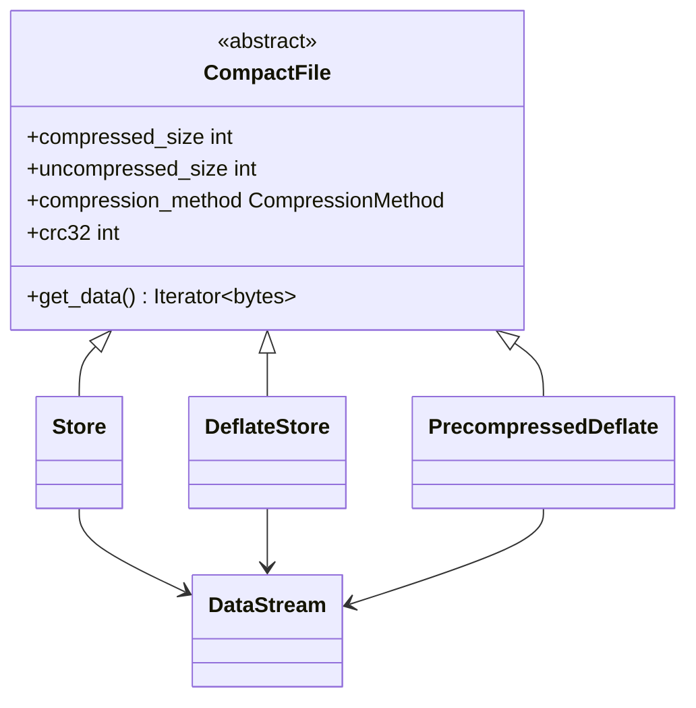

# Storage strategies

A **storage strategy** decides how a file's bytes are laid out inside the
archive. It is the component that makes LiveZip predictable, because it is the
thing that declares sizes before anything is read.

## The contract

Every strategy subclasses `CompactFile` and answers five questions:



| Member | Meaning |
| ------ | ------- |
| `compressed_size` | Exact number of bytes `get_data()` will yield. |
| `uncompressed_size` | Size of the original payload. |
| `compression_method` | `uncompressed` (0) or `deflate` (8). |
| `crc32` | CRC32 of the *original* payload. |
| `get_data()` | Yields exactly `compressed_size` bytes, in order. |

!!! danger "The one rule"
    `get_data()` must yield exactly `compressed_size` bytes. The encoder refuses
    to produce a corrupt archive, so a mismatch raises `ValueError` — but the
    right place to get it right is your strategy.

Note the asymmetry on `crc32`: for `Store` and `DeflateStore` it is computed
*while* streaming and is only valid after `get_data()` completes; for
`PrecompressedDeflate` it is supplied up front. The central directory is written
after all payloads, so by the time `crc32` is read it is always final.

## Choosing a strategy

| Strategy | Method | Output size | CPU | Use when |
| -------- | ------ | ----------- | --- | -------- |
| `Store` | 0 | `= n` | none | Payload is incompressible (video, JPEG, already-zipped). |
| `DeflateStore` | 8 | `n + 5·max(1, ceil(n/65535))` | none | Clients insist on DEFLATE, but you want no compression. |
| `PrecompressedDeflate` | 8 | `= compressed bytes` | none | Payload is *already* raw DEFLATE (S3 logs, cached archives). |

## `Store`

Copies bytes verbatim. It is handed the payload size and its `DataStream`, then
reads in 1 MiB chunks:

```python
from pathlib import Path

path = Path("video.mp4")
data = Store(FileStream(path), path.stat().st_size)
```

`sizes = (n, n)`, `compression_method = uncompressed`, and the CRC is computed as
a side effect of streaming.

## `DeflateStore`

Wraps the raw bytes in DEFLATE **stored** blocks (block type 00). Nothing is
compressed; the bytes are simply framed as a valid RFC 1951 stream. This exists
to satisfy tools and clients that refuse an entry whose method is 0. The framing
overhead is exactly five bytes per 65 535-byte block, so the size is still known
in advance:

```
compressed_size = n + 5 * max(1, ceil(n / 65535))
```

An empty payload still emits one empty final block (five bytes), so the result
is always a well-formed DEFLATE stream.

!!! tip "Stored, not deflated"
    `DeflateStore` does **not** shrink your data. If you want real compression,
    compress ahead of time and use `PrecompressedDeflate`; if you want zero
    overhead, use `Store`.

## `PrecompressedDeflate`

This is the strategy that makes the flagship S3 use case possible. It takes a
stream of **already raw-DEFLATE-compressed** bytes, plus the original size and
CRC32, and passes the bytes through untouched:

```python
data = PrecompressedDeflate(
    S3Stream(client, bucket, key),
    compressed_size=200_123,  # from the S3 listing
    uncompressed_size=2_004_560,  # from object metadata
    crc32=0x1A2B3C4D,  # from object metadata
)
```

Because all three numbers are known before the stream is opened, no payload has
to be downloaded just to plan the archive. That is the whole point.

!!! warning "Raw DEFLATE only"
    The payload must be an RFC 1951 stream (no zlib header/trailer, RFC 1950).
    ZIP's method 8 expects raw DEFLATE. Use
    `zlib.compressobj(level, zlib.DEFLATED, -zlib.MAX_WBITS)` — the `-15`
    window size is what strips the zlib wrapper. `livezip.s3.compress_deflate()`
    does exactly this.

### Where the metadata comes from

A raw DEFLATE stream does not carry the original size or a CRC32, so they must
travel alongside the bytes. The S3 integration stores them as object metadata at
upload time and reads them back when listing. The full contract is documented in
[Streaming from S3](s3-integration.md).

## Writing your own strategy

Subclass `CompactFile` and implement the five members. The only hard
requirements are:

1. **Know the sizes up front.** They cannot depend on reading the payload.
2. **Yield exactly `compressed_size` bytes.** Use `DataStream.read_exact()` if
   you need fixed-size buffers.

A trivial example — serving an in-memory buffer:

```python
import zlib
from collections.abc import Iterator

from livezip.models import CompressionMethod
from livezip.storage import CompactFile


class MemoryStore(CompactFile):
    def __init__(self, payload: bytes):
        self.payload = payload
        self._crc = zlib.crc32(payload)

    @property
    def compressed_size(self) -> int:
        return len(self.payload)

    @property
    def uncompressed_size(self) -> int:
        return len(self.payload)

    @property
    def compression_method(self) -> CompressionMethod:
        return CompressionMethod.uncompressed

    @property
    def crc32(self) -> int:
        return self._crc

    def get_data(self) -> Iterator[bytes]:
        yield self.payload
```

Add tests for the size contract — the unit suite's
`test_file_data_segment_rejects_oversized_streams` is the model.
