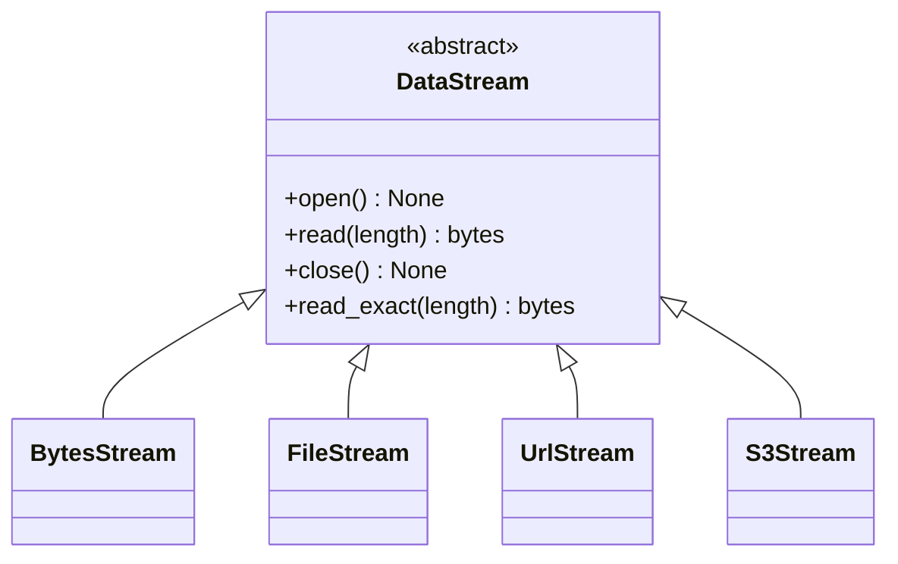

# Byte streams

A `DataStream` is a byte source whose resource is opened *lazily*, at the moment
the encoder actually needs bytes, and closed immediately after. This is what
lets LiveZip describe an archive without touching the data, and hold at most one
open source at a time.

## The interface



| Method | Contract |
| ------ | -------- |
| `open()` | Acquire the resource. Must be safe to call before each read pass. |
| `read(length)` | Return **up to** `length` bytes; empty means end of stream. |
| `close()` | Release the resource. Must tolerate being called when closed. |
| `read_exact(length)` | Concrete helper: loop `read()` until `length` bytes or EOF. |

`read()` follows the socket convention (it may return fewer bytes than asked).
Storage strategies that need a full buffer — `DeflateStore`'s fixed-size
DEFLATE blocks, for instance — call `read_exact()` instead.

## Implementations

| Class | Source | Rewindable | Notes |
| ----- | ------ | ---------- | ----- |
| `BytesStream` | An in-memory `bytes` | yes | For tests and small payloads. |
| `FileStream` | A local path | yes | Opens with `Path.open("rb")`. |
| `UrlStream` | An HTTP(S) URL | no | The URL is a callable, evaluated at `open()`. |
| `S3Stream` | An S3 object | no | Optional; see [S3 integration](s3-integration.md). |

## Why lazily?

Opening everything up front would be simple, but it breaks two real cases:

1. **Connection exhaustion.** An archive of ten thousand objects would need ten
   thousand open sockets at once. Lazy opening keeps it at one.
2. **Expiring URLs.** Signed S3/GCS URLs have a deadline. If you capture the URL
   at describe time, it may expire before the encoder reaches that file. Passing
   a *callable* defers signing to `open()`:

   ```python
   UrlStream(lambda: client.generate_presigned_url(...))
   ```

## Writing your own

Implement `open`, `read`, `close`, and make `open()` resumable (the encoder may
read a strategy more than once in tests). A minimal example:

```python
import urllib.request

from livezip.stream import DataStream


class HttpTextStream(DataStream):
    def __init__(self, url):
        self.url = url
        self.response = None

    def open(self):
        self.response = urllib.request.urlopen(self.url)

    def read(self, length):
        if self.response is None:
            raise RuntimeError("stream is not open")
        return self.response.read(length)

    def close(self):
        if self.response is not None:
            self.response.close()
            self.response = None
```

!!! tip "Test with a fragmenting stream"
    Real sources return short reads. The unit suite defines a
    `FragmentingStream` that returns one byte at a time and exercises
    `read_exact()` with it — a good pattern for any new stream.
