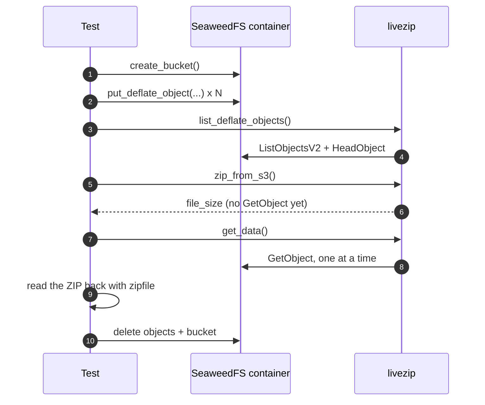

# Testing

LiveZip ships with two layers of tests and a CI pipeline that runs both. The
end-to-end layer is backed by a **real SeaweedFS container**, so the S3 code path
is exercised rather than mocked.

## Layout

```
tests/
├── conftest.py            # shared pytest configuration
├── helpers.py             # payloads and archive helpers
├── unit/
│   ├── test_models.py     # binary records
│   ├── test_storage.py    # storage strategies
│   ├── test_encode.py     # the encoder
│   ├── test_stream.py     # byte sources
│   ├── test_cli.py        # the console script
│   └── test_s3_unit.py    # S3 helpers against an in-memory fake client
└── e2e/
    ├── conftest.py        # SeaweedFS testcontainer + bucket fixtures
    └── test_s3_roundtrip.py
```

## Running

```bash
make test-unit   # fast, no Docker, no network
make test-e2e    # requires Docker; starts SeaweedFS
make test        # both
make coverage    # both, with a coverage report
```

The end-to-end tests are marked `e2e`:

```bash
uv run pytest -m "not e2e"   # exactly what the unit CI job runs
uv run pytest -m e2e         # exactly what the e2e CI job runs
```

If Docker is not reachable, the `e2e` tests **skip** rather than fail, so local
development never requires a daemon.

## The SeaweedFS fixture

`tests/e2e/conftest.py` starts one throwaway
[SeaweedFS](https://github.com/seaweedfs/seaweedfs) container per session with
[testcontainers](https://testcontainers-python.readthedocs.io/), pinned to
`chrislusf/seaweedfs:4.47`:

```python
container = (
    DockerContainer("chrislusf/seaweedfs:4.47")
    .with_command(f"server -s3 -s3.port={S3_PORT}")
    .with_exposed_ports(S3_PORT)
    .waiting_for(HttpWaitStrategy(S3_PORT).for_status_code(200))
)
```

A boto3 client (path-style addressing) points at it, and each test gets its own
uniquely named bucket, deleted on teardown. This gives real S3 semantics —
`ListObjectsV2`, `HeadObject`, `GetObject`, user metadata — without any external
service.



## What the end-to-end test proves

`tests/e2e/test_s3_roundtrip.py` walks the documented flow and asserts that:

- listing returns every object with the right compressed size, uncompressed size
  and CRC32;
- `zip_from_s3()` predicts `file_size` before any object body is fetched;
- streaming produces exactly `file_size` bytes;
- the archive opens in Python's `zipfile`, passes `testzip()`, and every
  entry's content matches the original log — including one payload large enough
  to span several DEFLATE blocks.

## Unit-testing the S3 layer without Docker

`tests/unit/test_s3_unit.py` uses a small in-memory `FakeS3Client` implementing
the `S3Client` protocol. It double-checks the important invariant that planning
performs **no** `GetObject` calls:

```python
encoder = zip_from_s3(client, "b", prefix="logs/")
assert client.get_calls == []  # only list + head happened

data = stream(encoder)
assert len(client.get_calls) == 3  # one fetch per object
```

## Continuous integration

`.github/workflows/ci.yml` has three jobs:

| Job | What it runs |
| --- | ------------ |
| `lint` | `ruff check`, `ruff format --check`, `mypy`. |
| `unit` | `pytest -m "not e2e"` on Python 3.11, 3.12 and 3.13. |
| `e2e` | `pytest -m e2e` on Python 3.12, with the SeaweedFS image pre-pulled. |

GitHub's Ubuntu runners provide Docker, so the same testcontainers fixture that
runs locally also runs in CI — no service containers to configure.

## Writing tests

- Put fast, deterministic tests in `tests/unit`.
- Assert on **behaviour**, not internals: build an archive and read it back with
  `zipfile`.
- For size-sensitive code, use the `FakeCompactFile` in `test_encode.py`, which
  declares huge sizes without producing bytes.
- For streams, use a **fragmenting** source that returns short reads, so
  `read_exact()` is genuinely exercised.
