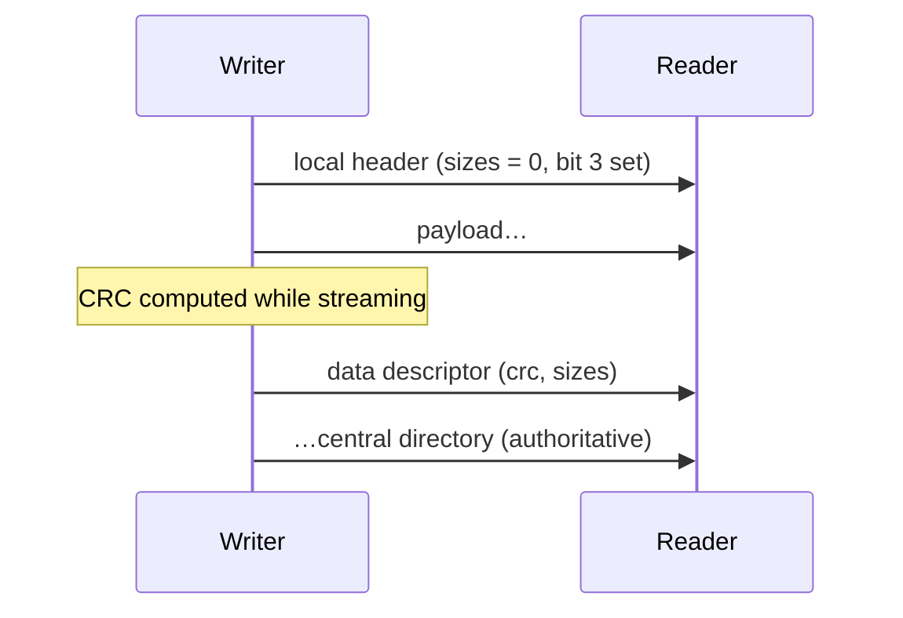
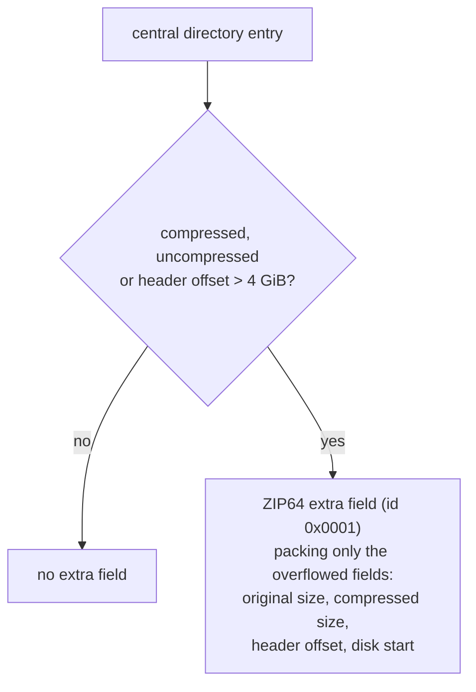

# The ZIP format, as LiveZip uses it

LiveZip only needs a small subset of [PKZIP / ZIP64][appnote]. This page lists
the records it emits, in the order it emits them, and explains the two
techniques that make streaming possible.

[appnote]: https://pkware.cachefly.net/webdocs/casestudies/APPNOTE.TXT

## Archive layout

```mermaid
flowchart TB
    subgraph entry["For each file"]
        LH["Local file header<br/>(PK&#92;x03&#92;x04)"]
        DATA["Payload bytes<br/>(stored or DEFLATE)"]
        DD["Data descriptor<br/>(PK&#92;x07&#92;x08)"]
        LH --> DATA --> DD
    end
    entry --> CD["Central directory<br/>one entry per file (PK&#92;x01&#92;x02)"]
    CD --> Z64["ZIP64 end of central directory (PK&#92;x06&#92;x06)<br/>ZIP64 locator (PK&#92;x06&#92;x07)<br/><i>only when needed</i>"]
    Z64 --> EOCD["End of central directory (PK&#92;x05&#92;x06)<br/>always last, carries the archive comment"]
```

Everything before the central directory is a pure function of the payloads;
everything from the central directory onward is a pure function of the offsets
computed in `prepare()`. That split is why LiveZip can stream.

## The records

| Record | Signature | Model | Purpose |
| ------ | --------- | ----- | ------- |
| Local file header | `PK\x03\x04` | `LocalFileHeader` | Entry name, method, timestamp. Sizes and CRC zeroed. |
| Data descriptor | `PK\x07\x08` | `DataDescriptor` | CRC and both sizes, written *after* the payload. |
| Central directory entry | `PK\x01\x02` | `CentralDirectoryFile` | The authoritative index entry, with real sizes/CRC/offset. |
| ZIP64 EOCD record | `PK\x06\x06` | `Zip64EndOfCentralDirectoryRecord` | 64-bit counts and offsets. Optional. |
| ZIP64 EOCD locator | `PK\x06\x07` | `Zip64EndOfCentralDirectoryLocator` | Points at the ZIP64 EOCD record. Optional. |
| End of central directory | `PK\x05\x06` | `EndOfCentralDirectoryRecord` | 32-bit summary, archive comment. Always last. |

All multi-byte integers are little-endian. Dates use the DOS format (clamped to
1980–2099, expressed in UTC).

## Technique 1: the streaming flag

The local file header comes *before* the payload, but the CRC32 and the
compressed/uncompressed sizes are only known *after* the payload has been read.
Classic writers solve this by buffering each file or by seeking back to patch
the header. LiveZip does neither.

Instead it sets general-purpose bit 3 (the "streaming" flag) and:

- writes `crc32 = 0`, `compressed_size = 0`, `uncompressed_size = 0` in the
  local header, and
- appends a **data descriptor** carrying the real values after the payload.

Readers that understand bit 3 look for the descriptor. Python's own `zipfile`
reads sizes and CRC from the central directory and therefore never even needs to
parse it — which is why LiveZip archives open cleanly everywhere.

## Technique 2: the ZIP64 extra field

ZIP64 is a set of escape hatches for values that overflow the original 32-bit
fields. The rule is precise: a ZIP64 extra field (id `0x0001`) is present on a
central directory entry **only** when at least one of its 32-bit fields is set to
`0xFFFFFFFF`, and it contains **only** the fields that overflowed, in a fixed
order.

LiveZip follows this exactly. The threshold is the 32-bit boundary
(`0xFFFFFFFF`), not the 16-bit one: the central directory stores sizes on 32
bits, so an entry only needs ZIP64 once it exceeds 4 GiB. Helper:
`models.needs_zip64_sizes()`.

The **data descriptor** widens to 8-byte sizes under the same condition, so a
single file larger than 4 GiB still streams correctly.

!!! warning "ZIP64 EOCD is a different switch"
    The ZIP64 end-of-central-directory records are emitted when the *archive*
    exceeds 65 535 entries or a central-directory offset overflows its 32-bit
    field — not when a single file is large.
    `Zip64EndOfCentralDirectoryRecordSegment.is_required` is the single source of
    truth for this.

## What LiveZip always sets

| Flag / field | Value | Reason |
| ------------ | ----- | ------ |
| General purpose, bit 3 | set | Streaming; sizes/CRC live in the data descriptor. |
| General purpose, bit 11 | set | Entry names are UTF-8. |
| Version needed / made by | 4.5 | ZIP64-capable reader required. |
| Compression method | `0` (store) or `8` (deflate) | Chosen by the storage strategy. |

## Further reading

- [PKWARE APPNOTE][appnote] — sections 4.3.7 (local header), 4.3.9 (data
  descriptor), 4.3.12 (central directory), 4.3.14–4.3.16 (EOCD records),
  4.5.3 (ZIP64 extra field).
- [`src/livezip/models.py`](https://github.com/OffworldNexus/livezip/blob/develop/src/livezip/models.py)
  — the models themselves.
