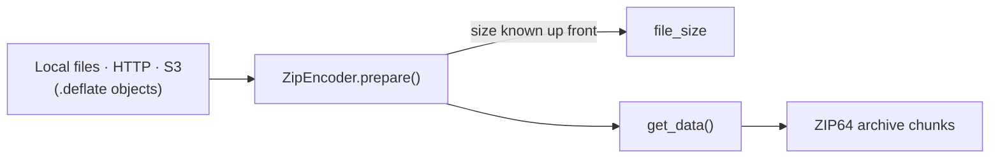

# LiveZip

**Memory-bound, streamable ZIP64 archives, streamed straight from storage.**

LiveZip builds a ZIP file as an iterator of byte chunks. It never holds the
archive, and never holds a payload: at any point in time it keeps only a small
descriptor per file — about a kilobyte each — regardless of how large the files
are.

It exists for one situation in particular: you have a bucket full of
already-compressed files and you need to hand a client a single archive *now*,
with a correct `Content-Length`, without staging gigabytes on disk.



<div class="grid cards" markdown>

- **Predictable size**

    The exact archive size is known before a single payload byte is read, so it
    can be announced over HTTP.

- **Bounded memory**

    `O(k)` in the number of files, `O(n)` in time. Size the machine by the file
    count, not by the total weight.

- **Streams from anywhere**

    Local files, HTTP URLs, and S3 buckets of DEFLATE-compressed objects, all
    through the same encoder.

</div>

## Where to start

The documentation targets **developers integrating or maintaining LiveZip**.

| Page | What you will find |
| ---- | ------------------ |
| [Developer overview](developer/index.md) | Install, first archive, and the mental model. |
| [Architecture](developer/architecture.md) | The modules and how the guarantees fall out of the design. |
| [The ZIP format](developer/zip-format.md) | The handful of PKZIP/ZIP64 records that matter. |
| [Encoding pipeline](developer/encoding-pipeline.md) | Segments, offsets and the streaming trick. |
| [Storage strategies](developer/storage.md) | How payloads are laid out and why size stays known. |
| [Byte streams](developer/streams.md) | Deferred I/O, and how to plug in a new source. |
| [Streaming from S3](developer/s3-integration.md) | The flagship logs-to-ZIP example. |
| [Command line](developer/cli.md) | The `livezip` console script. |
| [Testing](developer/testing.md) | Unit tests, SeaweedFS end-to-end tests, and CI. |
| [Contributing](developer/contributing.md) | Develop, test, and ship changes. |

## The one-minute version

```python
from livezip.s3 import create_client, zip_from_s3

client = create_client(region_name="eu-west-3")
encoder = zip_from_s3(client, "my-logs", prefix="2026/")

print(encoder.file_size)  # known up front
for chunk in encoder.get_data():  # objects fetched lazily, one at a time
    ...
```

Read on in the [S3 integration guide](developer/s3-integration.md).
